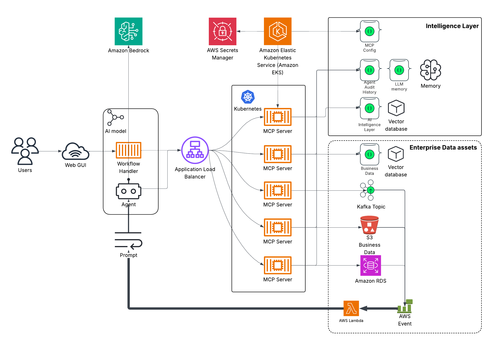

# Dynamic MongoDB MCP Server

A configurable Model Context Protocol (MCP) server that dynamically loads tool configurations from MongoDB. Includes a Web UI agent frontend backed by Amazon Bedrock.



## Architecture

```
webui/          Flask + React frontend, talks to MCP server over HTTP
mongo_mcp.py    FastMCP server exposing MongoDB tools via HTTP
mongomcp/       Core package: server, middleware, auth, Bedrock client, cache
mongomcp/agent/ Web UI subpackage: CachedQueryProcessor, ToolRouter, WebUiBedrockClient
```

## Memory Architecture

DynamicMCP treats memory as a persistent system primitive, not as text copied
back into a prompt. The memory service exposes typed MCP operations for storing,
recalling, linking, querying, and versioning records. Stateless workers mount
the same memory tool surface on every invocation, so durable knowledge and
behavior can be shared without relying on process-local state.

The model has two complementary retrieval modes:

- **General memory**: semantic recall over episodic and long-lived records,
  scored by vector relevance, importance, and temporal decay.
- **Behavioral memory**: versioned strategies and read-only query functions
  that provide a stable, governed execution path for recurring work.

Records are typed, scope-controlled, and explicitly linked. Query functions
turn an authored multi-step retrieval procedure into a named tool with a stable
contract; the runtime validates that these procedures remain read-only.

See [Memory architecture and decisions](docs/memory-architecture.md) for the
implementation model, [Memory workflow](docs/memory-workflow.md) for request
flows and MCP examples, and [Memory as a System Primitive](docs/memory-as-a-system-primitive.md)
for the full design article.

## Prerequisites

- Python 3.10+
- Docker (for container targets)
- AWS credentials in `~/.aws/` (Bedrock + Secrets Manager)
- MongoDB Atlas cluster with an MCP config collection and target data collection(s)


## Required Local Settings

Before running the local setup, create ignored local configuration files from
the tracked templates:

```bash
cp local_settings.example.py local_settings.py
cp webui/local_settings.example.py webui/local_settings.py
```

Then update the MongoDB credentials in both local settings files:

```python
self._credentials = {
    "username": "your_mongodb_username",
    "password": "your_mongodb_password",
    "mongoUrl": "your_cluster.mongodb.net"
}
```

These values must be set in both places:

- `MongoMCP/local_settings.py`
- `MongoMCP/webui/local_settings.py`

Both files are ignored by Git, so credentials and local tokens are not tracked.

The `mongoUrl` value is used by `tools/mongosetup.py` to rewrite `module_info.url` in the seeded `mcp_tools` documents.

For the Web UI, you must also copy the token printed by the setup script into `webui/local_settings.py`:

```python
self.AUTH_TOKEN = "paste_the_AUTH_TOKEN_value_here"
```

Run the setup scripts below after setting credentials. You will see an output line in this format:
See [MongoDB database setup](#mongodb-database-setup) for details on the database setup.

```bash
AUTH_TOKEN = "..."
```

## Quick Start

```bash
# 1. Create and activate a virtual environment
python -m venv .
source bin/activate

# 2. Install the MCP server package
pip install -e ./mongomcp

# 3. Install top-level dependencies
pip install -r requirements.txt

# 4. Seed local MongoDB config data and agent identity
python tools/mongosetup.py

# 5. Generate the airbnb vectors
python tools/embedairbnb.py

# 5. Run the MCP server
fastapi run mongo_mcp.py --port 8000

# 6. In a separate terminal install the webui
pip install -e "./mongomcp[agent]"
pip install -r webui/requirements.txt

# 7. Build the front end
cd webui/frontend
npm install
npm run build

# 8. in the webui dir run the web server
cd ../
python app.py
```


## MongoDB database setup

```bash
python tools/mongosetup.py
```

- create the `mcp_config` database if it does not exist
- create the `agent_identities`, `mcp_cache`, and `mcp_tools` collections
- load `tools/mcp_config.mcp_tools.json` into `mcp_config.mcp_tools`
- replace each `module_info.url` entry with the current local `settings.mongo_url` value
- generate a default local JWT for `webui_chatuser`
- upsert the generated metadata into `mcp_config.agent_identities`
- print the `AUTH_TOKEN = "..."` line for local settings updates

The portable semantic-memory seed is deliberately opt-in. To upsert
`tools/mcp_config.memory_semantic.json` into `mcp_config.memory_semantic` by
`_id`, run:

```bash
python tools/mongosetup.py --load-memory-seed
```

Re-running that command refreshes only the managed bootstrap records.

## Environment Variables

### MCP Server

| Variable | Default | Description |
|---|---|---|
| `AWS_REGION` | `us-east-2` | AWS region for Bedrock and Secrets Manager |
| `MONGO_CREDS` | — | AWS Secrets Manager secret name for MongoDB credentials |
| `MCP_TOOL_NAME` | `airbnbSearch` | Which tool config to load from MongoDB |
| `IS_LOCAL` | `true` | `true` = skip Secrets Manager, use hardcoded local creds |

### Web UI

| Variable | Default | Description |
|---|---|---|
| `AWS_REGION` | `us-east-2` | AWS region |
| `MONGO_CREDS` | — | AWS Secrets Manager secret name |
| `MONGO_MCP_ROOT` | `http://localhost:8000` | URL of the MCP server |

The `MONGO_MCP_ROOT` is auto-selected based on `IS_LOCAL`:
- `IS_LOCAL=true` → `http://localhost:8000`
- `IS_LOCAL=false` → `https://mcp.myendpoint.com`

---

## Makefile Reference

All build, run, and deploy operations are managed via `make`. Run `make help` to see all targets with current variable values.

### Build containers

```bash
make build           # build both
make build-mcp       # MCP server only
make build-webui     # Web UI only
```

### Run directly (local venv, no Docker)

```bash
make run-mcp         # fastapi on port 8000
make run-webui       # Flask dev server on port 8001
```

Equivalent direct commands without `make`:

```bash
python tools/mongosetup.py
fastmcp run mongo_mcp.py --transport http --port 8000
cd webui && python app.py
```

### Run from containers

```bash
make run-mcp-container      # detached, port 8000, ~/.aws mounted
make run-webui-container    # detached, port 8001, ~/.aws mounted
make run-containers         # both
```

### Stop containers

```bash
make stop            # stop both
make stop-mcp
make stop-webui
```

### Logs

```bash
make logs            # tail both
make logs-mcp
make logs-webui
```

### Publish to ECR + deploy

```bash
make publish         # ecr-login + build + tag + push both
make publish-mcp     # MCP server only  (tag: v20, latest)
make publish-webui   # Web UI only      (tag: v5, latest)
make deploy-webui    # force ECS redeployment
```

### Overridable variables

Any variable can be overridden on the command line:

```bash
make run-mcp MCP_TOOL_NAME=AirbnbSearch
make run-webui IS_LOCAL=false              # uses prod MCP URL
make run-containers MONGO_CREDS=prod/mongo MCP_TOOL_NAME=AirbnbSearch
make publish MCP_VERSION=21 WEBUI_VERSION=6
```

---

## Package Structure

`mongomcp` is a single pip-installable package with an optional `agent` subpackage:

```bash
pip install ./mongomcp           # server only (boto3, fastmcp, pymongo, motor, PyJWT)
pip install "./mongomcp[agent]"  # + agent deps (flask, gunicorn, pydantic)
```

The server container installs `mongomcp` only. The WebUI container installs `mongomcp[agent]`.

## Documentation

| Document | Purpose |
|---|---|
| [Memory architecture and decisions](docs/memory-architecture.md) | Data model, retrieval behavior, scopes, graph links, strategy versioning, and query functions. |
| [Memory workflow](docs/memory-workflow.md) | Agent and service workflows, record contracts, and a worked MCP example. |
| [Memory as a System Primitive](docs/memory-as-a-system-primitive.md) | Full technical article on deterministic retrieval and virtual abstractions over memory. |

---

## Dynamic Tool Configuration

The MCP server loads its tool definitions from a MongoDB collection at startup. Each document defines a complete server configuration — which database/collection to query, which tools to expose, their parameters, and index names.

See `tools/mcp_config.mcp_tools.json` for the local bootstrap configuration source. The `MCP_TOOL_NAME` environment variable selects which document to load.

### Available tool types

| Tool | Description |
|---|---|
| `vector_search` | Semantic search via `$vectorSearch` + AI embeddings |
| `text_search` | Full-text search via Atlas `$search` |
| `get_unique_values` | Discover distinct values for any field |
| `agg_pipeline` | Execute arbitrary aggregation pipelines |
| `get_collection_info` | Collection metadata, indexes, and schema |
| `geospatial_search` | Geo near queries against geospatial points |

---

## MongoDB Secrets Manager Secret

The `MONGO_CREDS` secret should contain:

```json
{
  "username": "your_mongodb_username",
  "password": "your_mongodb_password",
  "mongoUrl": "cluster.example.mongodb.net"
}
```

---

## IDE Integration (Cline / Copilot)

To connect a local IDE MCP client to the running server, start it with SSE transport:

```bash
fastmcp run mongo_mcp.py --port 8000
```

Then point your client at `http://localhost:8000/sse`.

---

## Troubleshooting

- **AWS auth errors**: confirm `~/.aws/credentials` is valid and the IAM role has Bedrock + Secrets Manager access
- **Tool discovery empty**: check `MCP_TOOL_NAME` matches a document `Name` field in your config collection
- **Vector dimension mismatch**: embedding dimensions in your index must match the model output (`amazon.titan-embed-text-v2:0` → 1024)
- **Container can't reach MCP server**: when running WebUI container locally, set `MONGO_MCP_ROOT=http://host.docker.internal:8000`
- **Any error with an IP address**: connection to MongoDB is not working. check network, or credentials.
