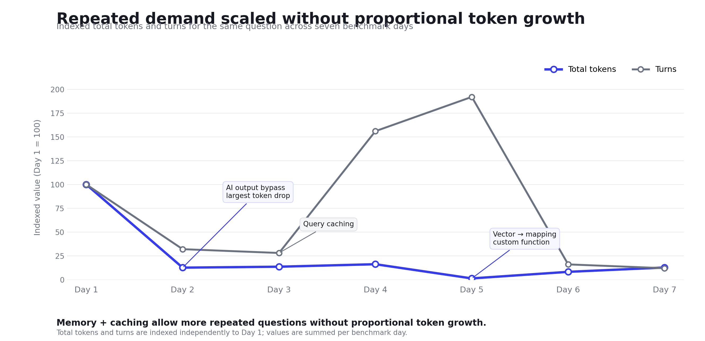

# Memory As A System Primitive: Beyond Context Windows And Vector Stores

Most treatments of "AI memory" make a category error: they treat memory as
content: text you retrieve and paste into a prompt. Even the frontier labs'
newest tooling, Anthropic's [memory and context
management](https://claude.com/blog/context-management), where the
model reads and writes file-like memory, is a sophisticated version of exactly
this framing. The more useful frame is that memory is a system primitive: a
typed, addressable, governed substrate that the runtime queries
deterministically, and on which higher-order behavior is composed rather than
prompted.

AI context windows are registers: fast, local, wiped on reset. Vector stores
are raw memory, powerful, unsafe to program against directly. The layer that
matters sits above both: typed records with encapsulated state, scopes as
access modifiers, strategies as virtual methods with genuine dispatch, and
AI-authored functions as compiled, versioned, permissioned methods across the
framework. Deterministic where it must be, fuzzy only at the first hop,
composed rather than prompted.

The system described here delivers that substrate through the [Model Context
Protocol](https://modelcontextprotocol.io). MCP is the ecosystem's bet that the
boundary between probabilistic models and deterministic systems should be
typed, versioned tool contracts. My proposal here pushes the same discipline
one layer down, into the memory boundary itself. The agent doesn't own the
store, it mounts it as a tool surface with contracts.

Accept that frame and two moves follow, each depending on the other:

1. Determinism can be reintroduced into a probabilistic system by letting the
   AI create fixed retrieval procedures once, instead of improvising them
   every turn.
2. Those procedures, plus the records they act on, form a virtualization
   hierarchy: inheritance and dispatch over raw memory, directly analogous to
   object oriented programming.

Deterministic functions are only safe because memory is typed and scoped.
Memory is only programmable at scale because functions virtualize it. Neither
works alone. But before diving too deep into the abstract architecture,
consider a real world analogy.

## Part 1: One Book Of Business, Three Vantage Points

Abstract architecture earns its keep in a concrete room, so put three people in
one: an insurance carrier. A field agent, an underwriter, and a risk analyst,
each with an AI assistant, all working the same book of business. Same claims
system, same policy records, same territory data, three entirely different
questions asked of it. Scoping keeps their private context private; the shared
scope is the commons where discoveries accumulate. Four discoveries follow,
each tied back to architectural primitives later. Each discovery is figured out
(and paid for) once by one assistant and then inherited by others, and the last
one shows memory doing something retrieval alone cannot.

**Discovery one: how to query a domain.** The claims system is a twenty-year-old
estate with pagination quirks, cryptic loss-cause code tables, and fields that
mean something other than their names. The first time the risk analyst's AI
assistant works out how to query it properly, that discovery is authored as a
method: `claims.find_similar(description, region, date_range)`, typed
signature, stable return contract, implementation hidden from the executing AI.
Published to shared scope, it now becomes how everyone's assistant queries
claims. The knowledge of how to interrogate a data domain is no longer a feat
of re-derivation each session; it is a compiled method in the class with tokens
paid only once.

**Discovery two: how data relates across domains.** Claims don't reference
policies cleanly. The join runs through a legacy composite key while policies
map to territories through zone codes that only make sense with the rating
manual open. The field agent's AI assistant untangles that one. The
relationships are stored as records in the substrate: claims &lt;-&gt; policies
&lt;-&gt; territories. The memory moves siloed knowledge to a repeatedly
navigable graph. Cross-domain structure, like query mechanics, should not be
rediscovered on every prompt for each user or agent.

**Discovery three: nobody rediscovers logic.** When the underwriter's assistant
needs claims-by-territory for a renewal decision, it doesn't reverse-engineer
anything. Instead the AI dispatches the shared strategies and inherits both
prior discoveries. Yet the feedback loop continues: the underwriter notices the
territory mapping mishandles postal codes that straddle two zones. The
correction enters as a new draft version, gets validated, gets published, and
every subsequent call lands on the fix, silently, via the most-recent dispatch
rule. Three humans, one substrate, and the system improves through use from any
seat. That is the feedback loop grounding trust, running at enterprise scale.

**Discovery four: putting it all together, where memory stops looking like
simple retrieval.** The risk analyst asks: "show me front-end impact claims
with airbag deployment, mapped across the coastal territories." The AI
assistant searches, finds, and composes the prior primitives into a novel
pattern:

- A hybrid search over claims narratives for "front end impact with airbag
  deployment," the one fuzzy step, semantic and keyword matching fused, because
  loss descriptions are written in adjuster shorthand and no exact-match query
  would find them.
- A deterministic join from the matched claim keys through the stored
  policy-territory relationship to geospatial coordinates. The cross-domain
  artifact does its job mechanically without the AI's creativity.
- A restructuring step that projects the result into map-ready form and
  renders JSON straight to the web UI. The output never enters the AI's
  context.

Note how much is happening beneath a one sentence prompt: the AI orchestrates
intent, kicks off a flow of deterministic steps, and the output delivery can
bypass the AI context entirely. The relevance score exists only on the search
output, and the pipeline carries it forward explicitly, driving the intensity
of each map marker. A naive AI system that simply re-fetched claims by key
would silently flatten the map, losing the connection between the first step
and the last. That same system would also require token payment for the
incoming coordinates and the outgoing JSON, wasting thousands of tokens because
neither drives any decision or logic.

Built conventionally, this is a custom feature requiring an engineering team,
sprints, a bespoke endpoint marrying full-text search to a GIS layer. Here it
is three primitives composed over a framework that already knows how to query
claims, already knows how claims relate to territories, and already carries
values forward by contract. The complexity didn't disappear; it was paid once
at authoring time, and amortized across every question any of the three
personas asks next.

That is the world of AI memory and context working to reduce token
consumption, driving business value in a deterministic manner. This brings us
to the chief problem with AI and how to address it technically.

## Part 2: The Determinism Problem

A vector store is nondeterministic at the point of use. The same intent,
embedded slightly differently, lands in a different neighborhood, and the
model improvises how to stitch the results together. Fine for fuzzy recall;
fatal for anything with a correctness contract, a compatibility check, a join
across records, or a cited source.

The fix is not "make the model more careful." That pays probabilistic tax every
turn for a procedure that should be fixed. Instead, separate authoring from
execution: the AI authors a named retrieval function as an ordered, read-only
pipeline of typed steps. The model's creativity is spent at design time;
execution is mechanical and unchanging.

This quarantines nondeterminism to exactly one place: the first fuzzy hop.
Since everything downstream depends on that hop landing in the right
neighborhood, it deserves the best retrieval machinery available: semantic
lookup with a quality embedding model, fused with classic lexical token
search, optionally reranked. A deterministic pipeline processing the wrong
records is still wrong; naked vector similarity contains the fuzziness, hybrid
retrieval is what makes it accurate. Everything downstream, filtering,
joining, ranking, projecting, is a compiled pipeline, fixed and inspectable.
Three properties make it real:

- **Type preservation.** Values extracted from one step and bound into the next
  carry their declared types. A string where an integer was expected fails
  deep in the pipeline, far from the cause. Determinism is as much about
  types as values, which we all understand from the core of typed and
  compiled languages.
- **Read-only by construction.** Define-time validation rejects any stage that
  writes or executes arbitrary code. A procedure the model authored cannot
  mutate the same substrate it reads and depends on.
- **Non-reconstructable values are first-class passengers.** A relevance score
  exists only on the output of the step that produced it. Any subsequent
  stage that fetches or joins records by key would silently discard a
  calculated value, so the pipeline must carry such values forward
  explicitly. It is important that the values are carried and not cached.

One more variable ensures mechanical execution: a pipeline's output contract
includes its destination. The AI is one possible consumer of a result, not the
only, even the mandatory, one. A typed result can flow straight to a screen, a
file, or another system, sparing the context window entirely. The framework
must allow the model to orchestrate intent and then step out of the data path.

This is not a minor optimization. It inverts the default economics of an
agent. In the ordinary AI conversational pattern, every retrieved record
round-trips through the context window: tokens in to describe it, tokens out
to reformat it. The AI (and someone's bank account) pays that tax on every row
whether or not the AI reasons over any of the data. Cost, latency, and
hallucinations scale with the size of the data, not the complexity of the
decision. When the pipeline owns its destination, that coupling breaks. The
model spends tokens on intent, a few lines to name the search, the join, and
the sink. Cost scales with the decision, and the data moves underneath it
freely.

The map from Part 1 is the clean case. The risk analyst's thousands of geo
coordinate pairs, each with its carried-forward score, render straight to the
screen; not one of them is serialized into the context window. Had the model
been forced to be the consumer, it would have paid to ingest every coordinate,
paid again to emit them, and risked overflowing its context before the map
ever drew, all to act as a dumb pipe for data it has no reason to read.

Underneath sits the retrieval philosophy: memory is an index, not the truth.
Search memory to navigate; fetch authoritatively from the source. The fuzzy
step locates while the deterministic steps ground and cite. The model never
holds the truth in context; instead, it holds a bag of tools defined as
pointers and defined procedures.

One-shot determinism isn't enough though. If a procedure can be redefined from
the feedback loop, the system is nondeterministic across time. The same call
behaves differently on different days with no record of why. So procedures
need a controlled lifecycle: a small state machine (draft -> published ->
retired) with single-step permissioned transitions and append-only
versioning. Redefinition never overwrites; it creates a new version with a
back-pointer to its ancestor and re-enters draft for validation. Because the
procedures are themselves stored as memory objects, the audit trail and the
rollback path come for free. Then the answer to "why did this behavior
change?" is just a memory query. This grants even more benefit: forward
looking self repair. What happens when the feedback is bad and the new
version fails? The full history is tracked, and the AI or the user can see
when and where the faulty change was made and fix it. Mistakes are useful
reminders here too; keeping failures in memory means the AI (or a different
human) does not suggest the same faulty procedure later.

Versioning also resolves a tension the real world forces. The world is messy,
memories accumulate nuance and revision. The rule that keeps this
deterministic: search across all versions, deliver only the latest. Every
version's text stays in the searchable corpus, which means an older phrasing
may be exactly what matches a user's query, but once a chain is located,
delivery resolves deterministically to its most recent published version.
Recency of behavior is not a ranking heuristic to be weighed against other
signals; it is a hard dispatch rule and conclusive output of the human-AI
feedback loop.

The feedback loop is critical to successful AI projects. The interaction
between human and agent is a continuous feedback loop with the human
validating or mending the AI's behavior. That loop is what grounds trust in
the system: every retrieval that lands or misses, every correction the user
makes, every promotion from draft to production passes through use. Trust is
not conferred once at authoring time. Determinism and trust accumulate and
converge across many iterations of the loop, and the permissioned lifecycle
transitions are exactly where the human hand rests on the lever.

How this is realized. This is not only a design sketch. It is implemented in
DynamicMCP. Typed records live in two MongoDB collections,
`memory_episodic` and `memory_semantic`. Versioned strategies are stored as
ordinary records in `memory_semantic`. Scopes are enforced by the runtime.
Read-only query functions move through a prod, dev, disabled, delete
lifecycle. A seeded strategy record is the base class from Part 3 made
concrete. Note the split between content and payload. Content is embedded,
searchable prose, and it is the interface. Payload is structured state, and it
is never embedded. The embedding vector is the public interface you never read:

```jsonc
{
  "strategy_key": "strategy_not_found_fallback",
  "memory_type": "strategy",
  "scope": 0,
  "decay_rate": 0,
  "content": "What to do when memory_strategy_recall returns no results ...",
  "payload": {
    "phases": {
      "phase_1_retry_without_tags": { "acceptance_floor": 0.4 }
    },
    "critical_rules": ["Never skip phase 1 retry before assuming no strategy exists"]
  },
  "tags": ["fallback", "routing", "tool-selection", "low-confidence"],
  "embedding": [ /* 1024 floats: the searchable projection */ ],
  "related_docs": [ { "id": "...", "relation": "references_strategy" } ]
}
```

These strategies compose over a deterministic surface. That surface is the
domain tool set: vector, text, hybrid, geospatial, rerank, and aggregate
search. Each one is validated read-only at define time. There are no write or
code-execution stages.

A worked example makes this concrete. A strategy does not stay prose. It gets
compiled into a named, typed query function that the runtime can dispatch.
Here is one that shipped, `fn_airbnb_price_map`, a two-stage function promoted
to prod. It turns a plain semantic request into a price-tiered map. Step one
runs a vector search and keeps only the handles. Step two takes those handles
and does the shaping work in the database:

```jsonc
{
  "fn_airbnb_price_map": {
    "handler": "multi_step",
    "stage": "prod",
    "output": "render",
    "required": ["query_text"],
    "steps": [
      {
        "name": "ranked",
        "uses": "vector_search",
        "index": "listing_vector_index",
        "num_candidates": 300,
        "limit": 40,
        "filters": [["address.market", "{{market}}"]],
        "extract": { "listing_ids": { "field": "_id", "mode": "list" } }
      },
      {
        "name": "render",
        "uses": "aggregate",
        "pipeline": [
          { "$match": { "_id": { "$in": "{{listing_ids}}" } } },
          { "$addFields": { "__rank": { "$indexOfArray": ["{{listing_ids}}", "$_id"] } } },
          { "$project": { "jsonDataType": "geospatial_scatter", "markers": 1, "summary": 1 } }
        ]
      }
    ],
    "source_strategy_name": "airbnb_listing_map_output",
    "version_seq": 7,
    "published_version_seq": 7
  }
}
```

Read what the pattern buys you. The strategy is the source. The function is
its compiled form, and the two are linked by `source_strategy_name` and a
version number. The step verb, `uses`, picks the search primitive. A vector
step and an aggregate step sit in the same function. Data moves between steps
by a bound token. Step one extracts `_id` values into `listing_ids`. Step two
references `{{listing_ids}}` inside a normal `$match`. The heavy work stays in
the database. The vector rank is preserved through the aggregation with
`$indexOfArray`, so ANN order survives a stage that would otherwise lose it.
When the function is called with `bypass`, the map renders straight to the UI
and only the compact summary returns to the model. That is the token-economy
claim from earlier, running as plumbing rather than as an assertion. The
single-agent behavioral interface and the compiled query function are the same
idea at two altitudes.

See it grounded in [Memory Architecture](memory-architecture.md), [Memory
Workflow](memory-workflow.md), [sample domain tools](../tools/mcp_config.mcp_tools.json),
and [seeded strategies](../tools/mcp_config.memory_semantic.json).

## Part 3: Object Oriented Programming Over The Memory Layer

Here is the load-bearing idea: treat the raw vector-indexed, decay-scored
record collections as physical memory. Nobody should program against it
directly any more than an application programmer hand-manages heap offsets.
Instead, define abstractions, classes, and inheritance like in object oriented
programming (OOP).

The document is the base class, containing both the AI content and structured
payload along with the framework's deterministic required fields for
searching, retrieval, scoping, and scoring. These fields together create the
split between a searchable embedded projection (the public interface) and
structured, never-embedded state (the private data). That split is
encapsulation: query the interface; act on the state.

Scopes are access modifiers: shared, agent-local, user-wide, session-local,
precisely public / protected / private. Scope is enforced by the runtime
rather than re-decided at each call site. Access control stops being prompt
discipline and becomes a type property removed from the AI's influence.

Strategies (agent skills, rules, playbooks) are virtual methods. A strategy
encodes how to act, dispatched by name or by semantic match. Strategies
inherit and override: a specific procedure extends a general playbook; a
sibling escalates to a fallback when its preconditions fail. The runtime
resolves the most specific applicable strategy and falls through to base
behavior only when no override matches. Two details matter. First, fallbacks
are not hard-coded escape hatches; they are authored abstractions in their own
right, created and stored in the same framework, and found the same way. For
example, on failure or a novel question, the runtime executes the same
rank-fusion search over the strategy corpus that lives with any other memory.
The playbook for "I don't have a playbook" is itself a record, strategy, and
subclass of memory. Second, semantic dispatch is the quarantined fuzzy hop
again: nondeterminism at the point of selection, determinism in everything
after selection. Versioning supplies the vtable swap: on publication of a new
version, the framework silently redirects every caller. Search spans every
version; dispatch always lands on the most recent published implementation.

Authored strategies may also be compiled methods bound to a domain: typed
signatures, stable return contract, an implementation of deep institutional
knowledge. Loading a domain into scope is loading a class's method table. The
agent calls `domain.method(args)`; the pipeline underneath is a detail it
neither sees nor reconstructs after authoring time.

Two retrieval regimes fall out of this fuzzy-versus-well-defined paradigm.
Behavioral artifacts, which are strategies or authored functions, are
dispatched under the hard most-recent rule: deterministic recency, no
exceptions. General memories, including episodic observations, preferences,
and facts about a messy world, live under a softer regime: temporal decay,
agent-assigned importance, and rank-fusion relevance combine to score what
surfaces. The split is principled, not accidental. Behavior must be
deterministic across time; recollection must be graded the way the world
actually is. A system that conflates the two either fossilizes its behavior or
makes its recall brittle.

### The Primitive Composes: Memory As Coordination Substrate

Everything above treated memory as the behavioral interface for a single agent.
The claim gets sharper under load. The same primitive composes. When a
long-running job fans out across many subagents, the memory record stops being
one agent's method table. It becomes the shared substrate the whole fleet
coordinates through. It is the heap, the checkpoint log, and the message bus
at once. No new abstraction is needed.

Three behaviors already in the primitive extend outward.

First, encapsulation becomes inter-process communication. A subagent does the
expensive work in its own context. It writes the full result to memory. It
returns only a handle, such as `{ batch_id, quality, sentiment, memory_id }`.
The parent passes references, not payloads.

Second, versioned append-only records become a write-ahead log. Checkpoints
like `last_completed_batch` and failed-batch markers let a crashed job resume
mid-stream instead of restarting.

Third, scope becomes the coordination boundary. Shared-scope records let peer
subagents see each other's output. The parent aggregates by querying a
session. It never holds N contexts open.

The payoff is that cost decouples from data volume. That is the essay's core
economic claim, and now it is measured under fan-out rather than asserted. In
a validated run of 400 items across memory-backed subagents:

- Parent context held under 2 KB against a 30 KB budget. That is a 93% reduction. Each subagent still held full working context.
- Per-iteration returns shrank from 434 tokens to roughly 45, about 89%. Subagents returned a handle and persisted the analysis instead of inlining it.
- Durable state cost about 300 bytes per batch. That is roughly 300 KB for 1,000 batches. Carrying the equivalent raw data through context would cost tens of megabytes.
- Resume from checkpoint completed in under a minute with no recomputation.



*Repeated benchmark questions can increase without proportional token growth
when memory, caching, output bypass, and server-side custom functions keep large
data out of the model context. Values are indexed to Day 1.*

Cost tracks the decision, not the data. That is what a real primitive should buy
you. Here it holds while the number of cooperating agents grows.

And the loop closes on itself. Coordination already flows through typed
records. So the substrate can observe its own behavior at zero added inference
cost. The runtime emits code-only signals from the existing invoke loop. These
include tool-call counts, token deltas, retries, namespace switches, and
strategy-recall scores. They are written as fire-and-forget records.
Ground-truth code metrics can drive the feedback directly. LLM self-assessment
stays advisory and never auto-applies. This is the difference between a log and
a nervous system. The same memory that stores what the agents did becomes the
signal that tunes what they do next. It is a governed feedback loop, not an
ungoverned consolidation pass.

The execution-loop mechanics are the batch loop, the minimal-return protocol,
checkpoint and resume, and the `related_docs` audit trail. They live in the
[companion workflow](memory-workflow.md) and are kept out of the essay body.

## Part 4: Why Stateless Compute Forces The Pattern

Ephemeral, horizontally-scaled compute has no in-process state to inherit
between turns; the entire object graph must be reconstituted from an external
framework on every invocation. That isn't an obstacle, it's the pressure that
turns memory into a primitive. Because the process is disposable, the class
hierarchy, scopes, strategies, authored functions, and version chains must
live in the store. And once it does, consistency comes free at scale: every
worker resolves the same virtual method table from the same shared memory
layer, so an arbitrary number of stateless executors behave identically
without holding state locally. In practice the connection point is MCP. Each
worker mounts the memory server as a tool surface, and the class hierarchy
arrives as typed tool contracts, identical for every executor. Determinism and
virtualization are what make that reconstitution trustworthy: each worker
rebuilds not just data but the exact dispatch behavior, versioned and
permissioned identically.

## Situating This

The instinct to borrow from systems architecture is not new, and perhaps
rather obvious. [MemGPT](https://arxiv.org/abs/2310.08560) made the
operating-system analogy first, memory tiers, paging, interrupts, but it
virtualizes capacity: moving data between fast and slow memory to simulate a
larger context. This proposal virtualizes the behavior: dispatch,
inheritance, and versioned methods over the store. Complementary layers of
the same stack. [Graphiti](https://arxiv.org/abs/2501.13956) builds
temporally-aware knowledge graphs that preserve historical relationships. Its
bi-temporal model is a close cousin of the append-only version chains here,
applied to facts rather than procedures. The [sleep-time
compute](https://arxiv.org/abs/2504.13171) line of work, background
consolidation that promotes episodic records toward semantic ones, is the
ungoverned ancestor of the lifecycle state machine: consolidation, but without
a permission model. And MCP is the same bet made at ecosystem scale: typed
contracts wherever a probabilistic model touches a deterministic system.

| System / Approach | Core analogy | What it virtualizes | Governed lifecycle? | Relation to this proposal |
|---|---|---|---|---|
| Plain RAG / vector store | Retrieve and paste | Nothing. Raw recall | No | The naive baseline. Nondeterministic at point of use, with no typed contract |
| MemGPT | Operating system (tiers, paging, interrupts) | Capacity. Moves data between fast and slow memory to simulate a larger context | No | A complementary layer. It virtualizes capacity. This virtualizes behavior |
| Graphiti | Bi-temporal knowledge graph | Facts. Historical relationships over time | Partial (bi-temporal) | A close cousin of append-only version chains, applied to facts rather than procedures |
| Sleep-time compute | Background consolidation (episodic to semantic) | Consolidation of memories | No (ungoverned) | An ungoverned ancestor of the lifecycle state machine. Consolidation without a permission model |
| MCP (ecosystem) | Typed tool contracts | The model-to-system boundary | Versioned contracts | The same bet at ecosystem scale. This proposal pushes it into the memory boundary |
| This proposal (memory as primitive) | OOP over raw memory (abstraction, encapsulation, scope, polymorphism) | Behavior. Dispatch, inheritance, versioned methods over the store | Yes. Draft, published, retired. Permissioned and append-only | |

Caption: Prior art borrows the systems-architecture instinct but stops short.
Each row virtualizes one thing. Only the whole stack locked together makes
memory both programmable and safe to execute against. That stack is typed and
scoped memory under dispatchable, versioned methods.

## Open Questions And Risks

Pushing the primitive from one agent to many raises the questions any
distributed system must answer. It is worth naming them plainly rather than
waving them off.

- **Concurrent writes.** When several subagents write at once, what stops a lost update or a torn record?
- **Read consistency.** When the parent aggregates a session mid-run, does it read a coherent snapshot or a smear of half-finished writes?
- **Ordering and causality.** If batch 12's summary depends on batch 11's, how is that order enforced without a central lock?
- **Contention and idempotency.** What happens when a failed subagent is retried and writes its result twice?

Here is the thing worth sitting with. None of these questions are new. None of
them are really about agents. They are the same consistency problems we have
always demanded answers to from server RAM, from a filesystem, and from any
shared store. Concurrent writes, coherent reads, ordering, and idempotent
retries. A systems programmer has reasoned about these for decades.

This is what makes memory as a primitive the right frame rather than a
metaphor. A primitive is the thing you build abstractions on top of. You build
on it precisely so that most code never touches it directly. A programmer must
know these hazards exist. But almost none of them should hand-write
cache-coherency or lock protocols against raw memory. They inherit correct
behavior from the layer beneath. They spend their attention on the problem,
not the plumbing. That is what an abstraction is for.

So the question is where these problems get answered. The answer is down, at
the database layer, not up at the agent. This is why the substrate is a real
transactional store and not a bag of vectors bolted to a prompt. Every hazard
above is a solved problem in a mature data store. By choosing that store we
inherit the solutions. We do not reimplement them one layer too high.

- Atomic document writes make a single record update all-or-nothing. There are no torn records and no half-written method tables.
- Snapshot isolation and multi-document transactions give the parent a coherent read of a session even while subagents are still writing into it.
- The versioned append-only pattern turns ordering into a data-modeling question. Checkpoints and `related_docs` edges carry the order. Retries stay idempotent because they key on the checkpoint instead of blindly appending.
- Durability and indexed recovery make resume from checkpoint a query, not a rebuild.

In other words, MongoDB handles the hard concurrency and consistency guarantees
for us. It does this the same way RAM and the OS handle them for an application
programmer. The agent layer does not invent a coordination protocol. It
delegates to one that has been hardened for a decade.

That is the quiet thesis restated at the systems level. An LLM's memory should
not be a novel data structure we hand-roll per project. It should be a
first-class primitive resting on infrastructure that already knows how to be
concurrent, consistent, durable, and queryable. The agent author, like the
application programmer, is then free to reason about behavior and leave the
plumbing to the layer built for it. The abstraction is what makes agents
programmable. The database underneath is what makes that abstraction safe to
run at scale.

Two honest caveats remain, outside what the store solves for free. Both live at
the application layer. That is exactly where a primitive expects you to still
make decisions. First, semantic conflict. Two agents can write contradictory
but individually valid facts. Resolving that is an application-level policy:
last-writer-wins, versioned supersede, or human review. The governance model
has to choose deliberately. Second, embedding drift. Over long-lived records,
recall quality is a maintenance concern, not a set-and-forget property. These
are the real open edges. The concurrency plumbing beneath them is not.

## Conclusion

These borrowings share an instinct but stop short of the whole move; the
layers only pay off when they lock together. Object-oriented programming
organized four things over raw memory: abstraction, encapsulation, scope, and
polymorphism. This allowed applications to call behavior by name, let data
carry its own guarantees, reach only what's permitted, and let one call
resolve to the right implementation at runtime. Memory needs all four before
an agent can both program and execute against it: strategies are the named
methods, versioning is the polymorphic dispatch that redirects every caller to
the newest implementation while older ones stay searchable, and the enforced
boundary between fuzzy and deterministic keeps the result inspectable, one
nondeterministic hop, fixed and typed everywhere after. That is why the layers
are one mechanism, not a feature list: a method is safe to expose only because
the memory beneath it is typed and scoped, and the memory is programmable only
because methods dispatch over it. Remove any layer and the rest collapse.
