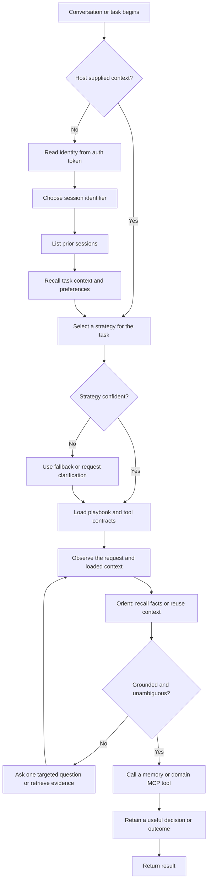

# Memory Workflow

This guide separates the agent operating loop from the memory service request
path. They are related but not interchangeable: the agent decides when to
recall, ground, and retain knowledge; the memory service enforces scopes,
persists records, performs retrieval, and maintains graph links.

## Operational Workflow

The outer loop is the canonical workflow used by agents that mount the memory
tool surface. `context_loaded` is an agent-host concern: it determines whether
the host has already supplied identity and prior context. It is not a field or
branch inside `MemoryService`.



The grounding gate is important: retrieved material is evidence to work from,
not permission to fabricate an answer. When the request is ambiguous or recall
does not establish the needed fact, the agent asks a focused question or gathers
more data.

## Memory Service Request Path

The server implementation follows a narrower, deterministic flow. Memory tools
are registered on a dedicated `memory-server` FastMCP instance. The token-derived
agent identity is supplied by the tool wrapper; the service connects lazily to
MongoDB and routes records according to their integer scope.

```mermaid
flowchart LR
    caller[MCP caller] --> auth[FastMCP auth and token-derived agent identity]
    auth --> tool{Memory tool}

    tool -->|intake or strategy_store| write[Validate metadata and select scope]
    write --> tier{Scope tier}
    tier -->|0, 10, 20| semantic[(memory_semantic)]
    tier -->|30, 40| episodic[(memory_episodic)]
    write --> embed[Embed content when supplied]
    embed --> persist[Persist record, payload, and explicit links]
    persist --> result[Structured result]

    tool -->|recall or strategy_recall| lookup[Build visibility and retrieval filters]
    lookup --> search[Vector search or direct entity lookup]
    search --> rank[Rank and resolve results]
    rank --> graph[Optionally traverse related_docs]
    graph --> result

    tool -->|reflect| maintain[Summarize, link, or update entities]
    maintain --> persist
    tool -->|query, list_sessions, schema_declare| direct[Execute the requested metadata operation]
    direct --> result
```

`recall` is the general-memory path. It uses vector similarity when a query is
provided, supports direct entity lookup without an embedding call, applies
visibility checks, and can expand explicit `related_docs` edges. `strategy_recall`
is the behavioral-memory path: strategy text is discovered semantically, then
version resolution selects the current authoritative strategy.

## Record Contract

Most memory records use the following fields. The `payload` is deliberately
structured; it should hold machine-readable state rather than force clients to
parse prose.

| Field | Purpose |
|---|---|
| `content` | Human-readable, semantically searchable record content. |
| `memory_type` | Classification such as `task`, `session:summary`, `strategy`, or `schema:<name>`. |
| `scope` | Visibility boundary: `0`, `10`, `20`, `30`, or `40`. |
| `username`, `agent_id`, `session_id` | Ownership and provenance inputs for visibility and grouping. |
| `importance`, `decay_rate` | Signals used to rank general-memory recall over time. |
| `tags`, `entities` | Categorization and direct entity retrieval. |
| `payload` | Structured metadata, validated against an optional declared schema. |
| `related_docs` | Explicit typed edges to other memory records. |

Choose scope intentionally. Shared knowledge belongs at scope `0`; a durable
user preference belongs at `20`; working state for the current conversation
normally belongs at `30`. The server, rather than the model, enforces the
visibility boundary.

## Worked Example

The following sequence records a user decision, makes the relationship to a
follow-up record explicit, and retrieves the resulting context. Values shown as
placeholders should be supplied by the caller's authenticated runtime.

```text
1. memory_intake(
       content="The user prefers concise architecture diagrams with a text fallback.",
       memory_type="preference",
       username="<username>",
       session_id="<session_id>",
       scope=20,
       importance=0.8,
       decay_rate=0.001,
       entities=["documentation", "diagrams"],
       payload={"diagram_format": "mermaid_with_text_fallback"}
   )

2. memory_intake(
       content="Added an operational memory workflow document.",
       memory_type="task:outcome",
       username="<username>",
       session_id="<session_id>",
       scope=30,
       importance=0.6,
       entities=["documentation", "memory workflow"]
   )

3. memory_reflect(
       operation="link",
       memory_ids=["<preference_id>"],
       target_ids=["<outcome_id>"],
       link_relation="informed",
       inverse_relation="resulted_in"
   )

4. memory_recall(
       query="How should the documentation diagrams be presented?",
       username="<username>",
       scope="all",
       entities=["documentation"],
       depth=1
   )
```

The last call uses the preference as the main match and can return its linked
task outcome as a graph neighbor. A client that needs an exact document should
use `memory_query(ids=[...])`; direct ID retrieval is not a semantic search and
does not depend on the wording of a query.

## Retention And Promotion

Use episodic memory for the working trace of a task: observations, decisions,
intermediate results, and a session summary. Promote a pattern to semantic
memory only when it is reusable beyond that session. Strategies and shared
knowledge should be versioned or explicitly linked rather than silently
overwritten, so future agents can both reuse the current behavior and inspect
how it evolved.

See [Memory architecture and decisions](memory-architecture.md) for the
implementation detail and [Memory as a System Primitive](memory-as-a-system-primitive.md)
for the design rationale.